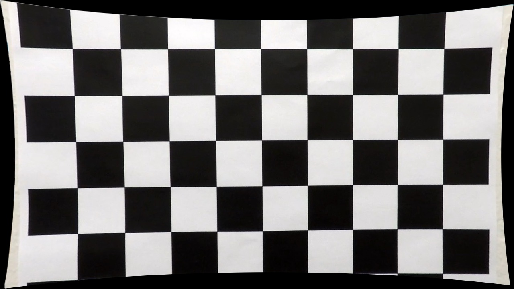
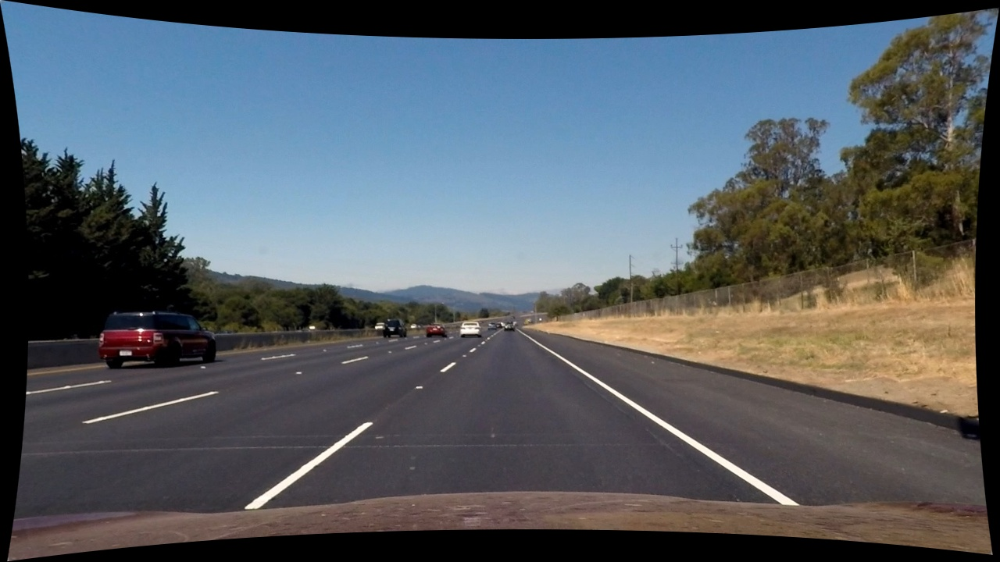
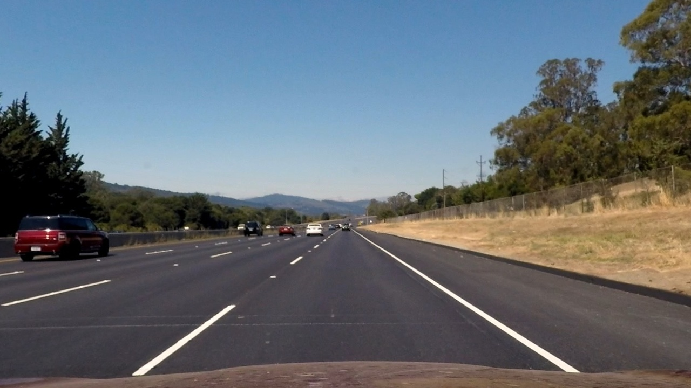
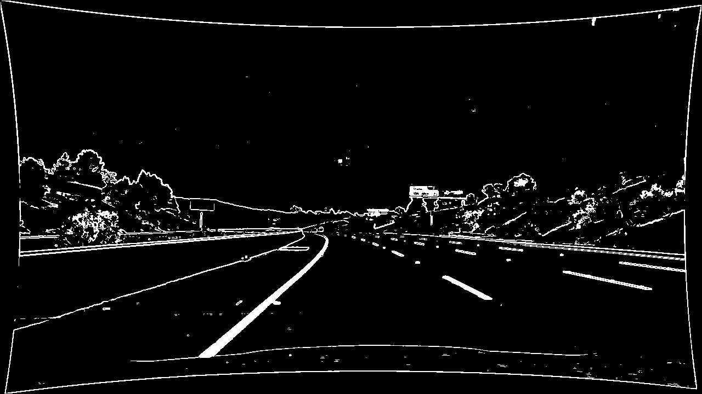
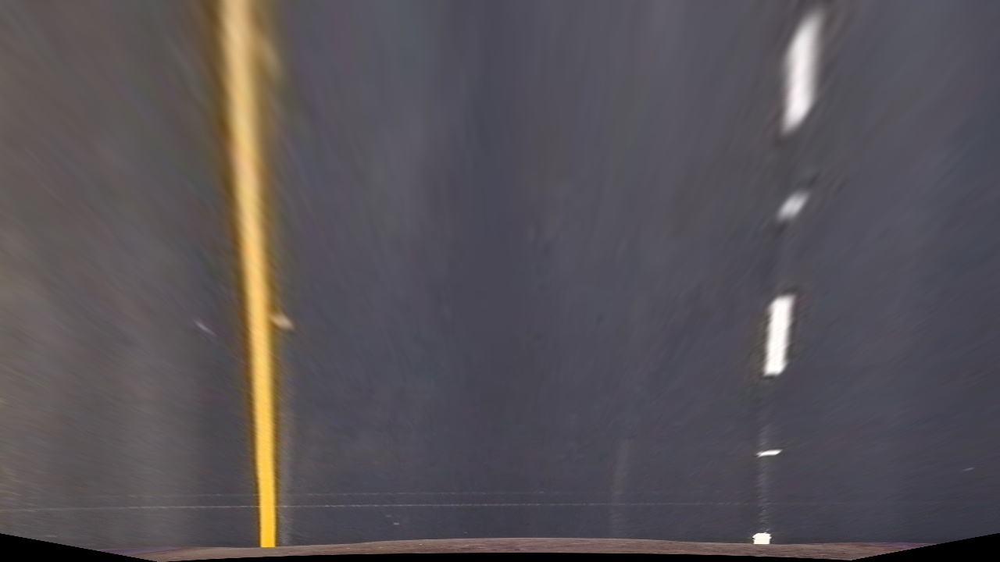
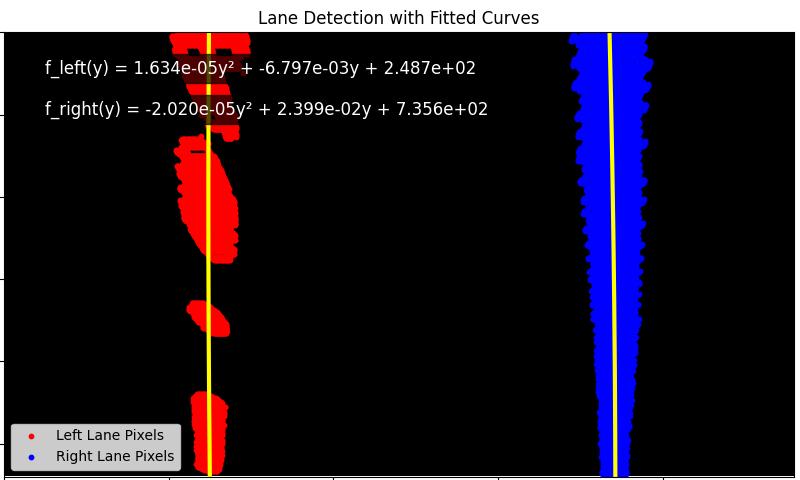

# lane-finding-project

**Lane Finding Project**

The goals / steps of this project are the following:

* Compute the camera calibration matrix and distortion coefficients given a set of chessboard images.
* Apply a distortion correction to raw images.
* Use color transforms, gradients, etc., to create a thresholded binary image.
* Apply a perspective transform to rectify binary image ("birds-eye view").
* Detect lane pixels and fit to find the lane boundary.
* Determine the curvature of the lane and vehicle position with respect to center.
* Warp the detected lane boundaries back onto the original image.
* Output visual display of the lane boundaries and numerical estimation of lane curvature and vehicle position.

[//]: # (Image References)

[image1]: ./examples/undistort_output.png "Undistorted"
[image2]: ./test_images/test1.jpg "Road Transformed"
[image3]: ./examples/binary_combo_example.jpg "Binary Example"
[image4]: ./examples/warped_straight_lines.jpg "Warp Example"
[image5]: ./examples/color_fit_lines.jpg "Fit Visual"
[image6]: ./examples/example_output.jpg "Output"
[video1]: ./project_video.mp4 "Video"

---

### Camera Calibration

#### 1. Briefly state how you computed the camera matrix and distortion coefficients. Provide an example of a distortion corrected calibration image.

Set of chessboard images with visible pattern are used to compute the camera matrix and distortion coefficients, but firstly detect the corners of the chessboard. Then 3D point were paired with the 2D points for each calibration image. Cv.calibrateCamera() function was used to compute the camera matrix and distortion coefficients. The result is stored in camera_cal/calib.npz. 

<p align="center">
  
  
</p>

### Pipeline (single images)

#### 1. Provide an example of a distortion-corrected image.
When we use cv2.undistort(img, mtx, dist, None, newCameraMtx), we can choose if we want to use new optimal camera matrix provided from newCameraMtx = cv2.getOptimalNewCameraMatrix() or unchanged input matrix. 

<p align="center">
  
  
  
</p>

#### 2. Describe how (and identify where in your code) you used color transforms, gradients or other methods to create a thresholded binary image.  Provide an example of a binary image result.

Here is a brief explanation of the code used to create a thresholded binary image:

The color_threshold function processes the image in two color spaces, HLS and HSV. It extracts the saturation (S) channel from HLS and the value (V) channel from HSV, applying thresholds to each. The resulting binary masks are combined to isolate pixels based on their color and brightness.

The magnitude_threshold function calculates the gradient magnitude of the image using Sobel operators in the x and y directions. The combined gradient magnitude is then scaled and thresholded to produce a binary image that highlights edges based on changes in intensity.

The combine_thresholds function creates a binary image by combining two separate thresholding methods: one based on gradient magnitude and the other on color filtering. It merges the results into a single binary mask, where pixels are set to 1 if they meet the criteria from either method.

<p align="center">
  
  
</p>

#### 3. Describe how (and identify where in your code) you performed a perspective transform and provide an example of a transformed image.

The first step in performing a perspective (birds-eye) transform is to define the source and destination points. The source point were made by manually selecting the four corners of the road in the image so we made so called Region of Interes. The destination point were selected by manually selecting the four corners of the road in the birds-eye view. SOurce and destination points are different for different image size.

Then we perform the perspective transform with OpenCV cv2.getPerspectiveTransform() and cv.warpPerspective().

Later on in draw.py i used cv2.getPerspectiveTransform() again to inverse matrix in order to print lines on normal perspective.

<p align="center">
  
  

#### 4. Describe how (and identify where in your code) you identified lane-line pixels and fit their positions with a polynomial?

To identify lane-line pixels in the binary warped image, the sliding window method was implemented. Initially, a histogram of pixel intensity was computed across the lower half of the image using the calculate_histogram function. The histogram's peaks on the left and right sides of the image were used to estimate the starting positions of the left and right lane lines, respectively. This serves as the base for the sliding windows.

```python 
def calculate_histogram(binary_image):
    return np.sum(binary_image[binary_image.shape[0]//2:, :], axis=0)

histogram = calculate_histogram(binary_image)
midpoint = int(histogram.shape[0] / 2)
left_base_x = np.argmax(histogram[:midpoint])
right_base_x = np.argmax(histogram[midpoint:]) + midpoint
```
The sliding window technique iteratively searches for lane-line pixels. The binary image is divided into vertical windows, and within each window, a search is performed around the current lane-line position. If sufficient lane-line pixels are found in a window, the center of the window is updated to the mean x-coordinate of those pixels. This process repeats for all windows, effectively capturing the x and y positions of lane-line pixels for both the left and right lanes. The results are stored as left_x_positions, left_y_positions, right_x_positions, and right_y_positions.

```python
  def sliding_window(binary_image, num_windows=9, window_margin=100, min_pixels=50):
    window_height = int(binary_image.shape[0] / num_windows)
    nonzero = binary_image.nonzero()
    nonzeroy = np.array(nonzero[0])
    nonzerox = np.array(nonzero[1])

    left_current_x = left_base_x
    right_current_x = right_base_x
    left_lane_indices = []
    right_lane_indices = []

    for window in range(num_windows):
        win_y_low = binary_image.shape[0] - (window + 1) * window_height
        win_y_high = binary_image.shape[0] - window * window_height
        win_xleft_low = left_current_x - window_margin
        win_xleft_high = left_current_x + window_margin
        win_xright_low = right_current_x - window_margin
        win_xright_high = right_current_x + window_margin

        valid_left_indices = ((nonzeroy >= win_y_low) & (nonzeroy < win_y_high) &
                              (nonzerox >= win_xleft_low) & (nonzerox < win_xleft_high)).nonzero()[0]
        valid_right_indices = ((nonzeroy >= win_y_low) & (nonzeroy < win_y_high) &
                               (nonzerox >= win_xright_low) & (nonzerox < win_xright_high)).nonzero()[0]

        left_lane_indices.append(valid_left_indices)
        right_lane_indices.append(valid_right_indices)

        if len(valid_left_indices) > min_pixels:
            left_current_x = int(np.mean(nonzerox[valid_left_indices]))
        if len(valid_right_indices) > min_pixels:
            right_current_x = int(np.mean(nonzerox[valid_right_indices]))

    left_lane_indices = np.concatenate(left_lane_indices)
    right_lane_indices = np.concatenate(right_lane_indices)

    left_x_positions = nonzerox[left_lane_indices]
    left_y_positions = nonzeroy[left_lane_indices]
    right_x_positions = nonzerox[right_lane_indices]
    right_y_positions = nonzeroy[right_lane_indices]

    return left_x_positions, left_y_positions, right_x_positions, right_y_positions
```
Once the lane-line pixels were identified, a second-order polynomial was fitted to the detected points for both the left and right lane lines using numpy.polyfit. This polynomial fitting generates coefficients that define the curve for each lane line. The resulting polynomial equations allow for calculating the x-positions of the lane lines across the y-axis range of the image.

```python
left_fit_coefficients = np.polyfit(left_y_positions, left_x_positions, 2)
right_fit_coefficients = np.polyfit(right_y_positions, right_x_positions, 2)
```
<p align="center">
  
  
</p>


#### 5. Describe how (and identify where in your code) you calculated the radius of curvature of the lane and the position of the vehicle with respect to center.

**Radius of Curvature**
The curvature is calculated for both the left and right lane lines in real-world space by:

Converting pixels to meters using the conversion factors ym_per_pix (meters per pixel in the vertical direction) and xm_per_pix (meters per pixel in the horizontal direction). This step adjusts for real-world lane dimensions.
```python
   if binary_warped.shape[0] == 540:
        # Conversion factors for pixels to meters
        ym_per_pix = 30 / 540  # meters per pixel in y dimension
        xm_per_pix = 3.7 / 480  # meters per pixel in x dimension (average lane width is 3.7 meters)
    else:
        ym_per_pix = 30 / 720 
        xm_per_pix = 3.7 / 700
```
Fitting a new polynomial for lane line curvature in the real-world coordinate system
Calculating the radius of curvature at the bottom of the image (y_eval), using the formula, where left_fit_cr[0-1] and right_fit_cr[0-1] are the coefficients of the second degree polynomal fit:
```python
left_curverad = ((1 + (2 * left_fit_cr[0] * y_eval + left_fit_cr[1]) ** 2) ** 1.5) / np.absolute(2 * left_fit_cr[0])
right_curverad = ((1 + (2 * right_fit_cr[0] * y_eval + right_fit_cr[1]) ** 2) ** 1.5) / np.absolute(2 * right_fit_cr[0])
```
Averaging the curvature of both lane lines for a combined radius of curvature.
```python
  curvature_radius = (left_curverad + right_curverad) / 2
```
**Vehicle position**

Calculating the lane center at the bottom of the image using the fitted polynomials for the left and right lanes:
```python
  left_x_bottom = left_fit[0] * y_eval**2 + left_fit[1] * y_eval + left_fit[2]
  right_x_bottom = right_fit[0] * y_eval**2 + right_fit[1] * y_eval + right_fit[2]
  lane_center = (left_x_bottom + right_x_bottom) / 2
```

Determining the vehicle center based on the image dimensions, assuming the camera is mounted at the center of the vehicle:
```python
  vehicle_center = (binary_warped.shape[1] / 2)
```

Calculating the offset in pixels and converting it to meters using the horizontal conversion factor:
```python
  vehicle_offset_pixels = image_center - lane_center
  vehicle_offset_meters = vehicle_offset_pixels * xm_per_pix
```


#### 6. Provide an example image of your result plotted back down onto the road such that the lane area is identified clearly.

TODO: Add your text here!!!

### Pipeline (video)

#### 1. Provide a link to your final video output.  Your pipeline should perform reasonably well on the entire project video (wobbly lines are ok but no catastrophic failures that would cause the car to drive off the road!).

TODO: Add your text here!!!

### Discussion

#### 1. Briefly discuss any problems / issues you faced in your implementation of this project.  Where will your pipeline likely fail?  What could you do to make it more robust?

TODO: Add your text here!!!

